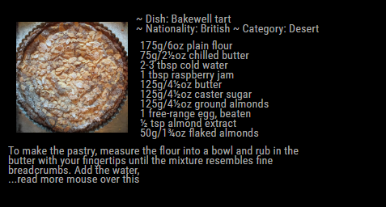
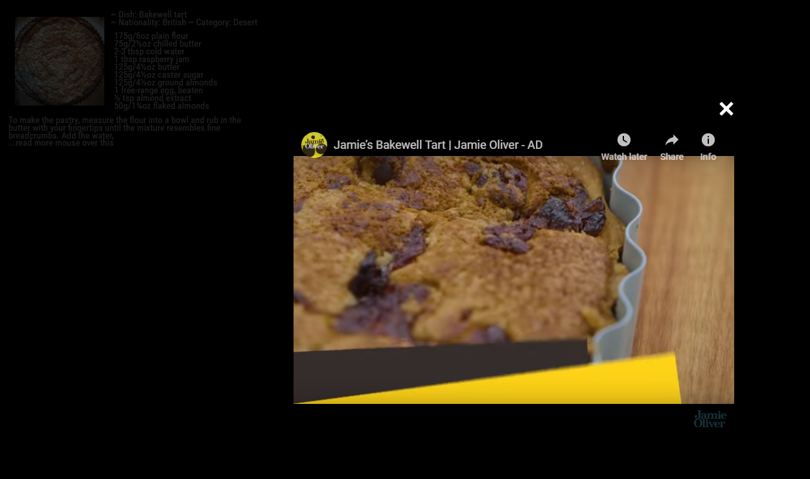

# MMM-Recipe
Daily recipe for MagicMirror2

##Examples:

Simple recipe

Example showing video

This module shows a menu daily on the MagicMirror2

To customize size and header title use the config options:

Example:
      {
       module: 'MMM-Recipe',
       position: 'bottom_bar',
       config: {
	  maxWidth: "100%",
	  video:  true //default is true if you want to be able to play video of recipe
               }
           },  
 
