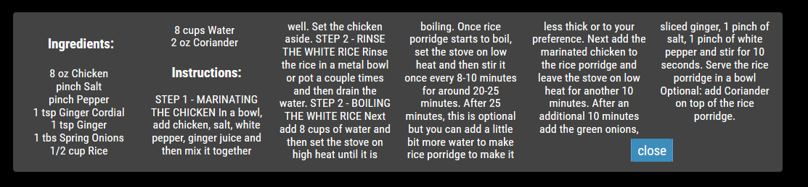
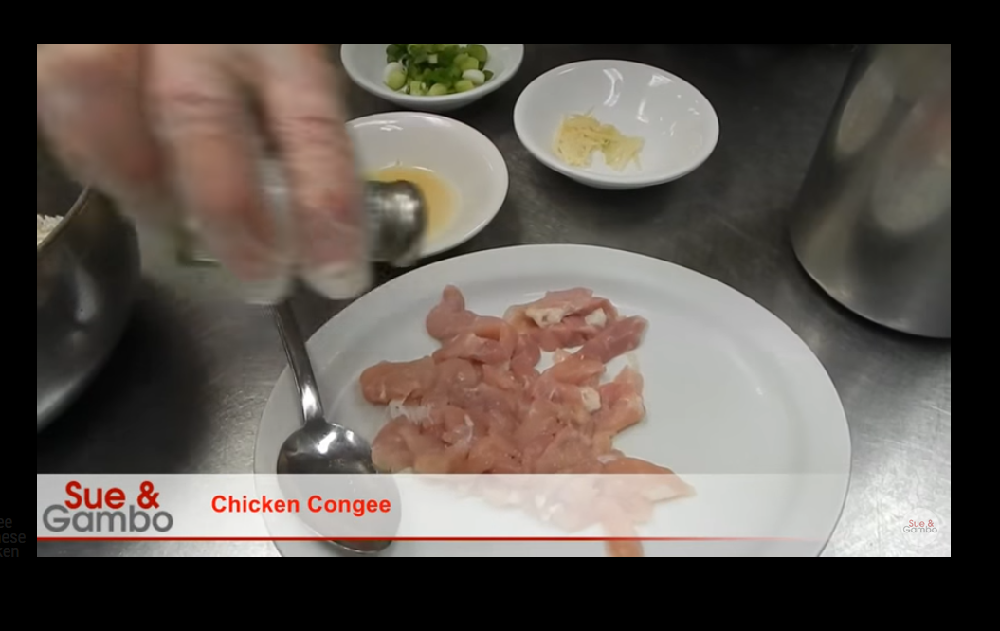

# MMM-Recipe

 FINALLY it's ready..... :)  
 
Daily recipe for MagicMirror2  ALL NEW FOR 2020

#Examples:

Recipe


Ingredients and Instructions


Video to go along with recipe!


This module shows a menu daily on the MagicMirror2

You can decide whether or not you want to have access to the video by using the config (see example config below)

**Example:**
```
{
    disabled: false,
    module: 'MMM-Recipe',
    position: 'bottom_bar',
    config: {
        video: true, //default is true if you want to be able to play video of recipe
        updateInterval: 180 * 60 * 1000, // every 3 hours Suggest you don't do it more often then this.
    }
},
```
